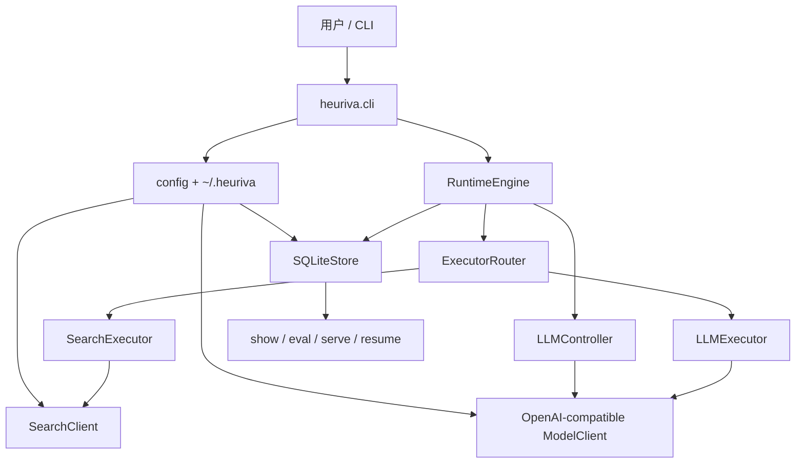

# Heuriva

[English README](README.md)

Heuriva 是一个用 Python 写的 **CLI 认知运行时**：让语言模型在显式状态、动态操作选择和可落库轨迹的帮助下，一步一步求解任务。

它不是通用 Agent 框架，不是消息网关，也不是以 SDK 为先的库。日常入口是 `heuriva` 命令行，以及本机 **Session UI**（`heuriva serve`）。可选的 **Tauri** 安装包只是同一套 Session 面的薄壳 + Python sidecar——不是远程 dashboard，不是飞书，也不是 VERIFY。

## 它做什么

- 每个任务在三个认知操作间动态选择：`ANALYZE`、`SEARCH`、`ANSWER`（不是写死流水线）。
- 维护不可变的 `CognitiveState` 与稳定的 `TaskContract`。
- **Controller 只选 operator**；**ExecutorRouter** 用确定性规则映射执行器。
- 每一步已提交的 state / decision / observation 写入本地 SQLite。
- 答案引用必须能回映射到已保存 evidence；完成度按任务合同评估（默认 quality mode 为 `observe`）。
- 可用 CLI 或本机 **Session UI**（`heuriva serve`）发任务、浏览最近列表、看详情、续跑；可选 Tauri `.dmg` / `.exe` 安装包是同一 UI 的薄壳。

## 快速开始

```bash
python3 -m venv .venv
.venv/bin/pip install -e '.[dev]'

heuriva setup
heuriva doctor --probe
heuriva run --trace "分析这个项目是否值得做成产品"
```

默认对接 OpenAI-compatible 端点（`http://localhost:8765/v1`，`model: auto`）。可用 `HEURIVA_LLM_BASE_URL` / `HEURIVA_LLM_MODEL` 指向任意兼容的 chat completions 服务。

```bash
# 检视 / Session
heuriva list                     # 最近任务：缩略 id + status + goal
heuriva list --json --limit 50
heuriva show --trace <task_id>
heuriva serve                    # 本机 Session UI（发任务 / 列表 / 续跑）
heuriva serve --read-only        # 仅只读检视
heuriva eval <task_id>           # 只读质量摘要
heuriva eval --judge <task_id>   # 显式 opt-in 的模型评判

# Ctrl+C / 失败后续跑（只追加 steps，不改写历史）
heuriva resume <task_id>

# 默认离线的回归套件
heuriva eval-suite
```

桌面安装包（可选；Tauri 壳 + Python sidecar，同一 Session UI）：

```bash
./scripts/build-desktop.sh           # macOS .dmg / .app
./scripts/build-desktop-windows.sh   # Windows best effort
```

详见 `desktop/README.md`。未签名本地包可能触发 Gatekeeper / SmartScreen。

结构化完成合同（可选）：

```bash
heuriva run --criterion-exact 'OK' "只返回 OK，不要其他文字。"
heuriva run --criterion 'must_include:取舍' --search-policy forbidden \
  "只基于本地项目方向说明，不访问 Web"
```

## 架构设计

```text
CLI / config
  → RuntimeEngine
  → CognitiveState + TaskContract
  → LLMController  （每步只选一个 operator）
  → ExecutorRouter （ANALYZE/ANSWER → llm，SEARCH → search）
  → OperationResult → 校验（搜索 / 引用 / 完成度）
  → StateUpdater   （生成下一个不可变 state）
  → SQLiteStore    （单步原子提交）
  → show / eval / serve / resume
```



### 设计不变量

| 关注点 | 做法 |
| --- | --- |
| 状态 | 不可变快照；patch 不能改写 goal / TaskContract |
| 控制 | Controller 只选 operator；Router 映射 executor |
| 证据 | 搜索候选 vs accepted evidence；只有后者算实质进展 |
| 答案 | `[S1]` 等引用标签必须映射到已保存 evidence |
| 质量 | 确定性检查 + 可选模型 assessor/judge；默认保持 `observe` |
| 持久化 | 每个已提交 step 一次 SQLite 事务 |
| 恢复 | 装载最后一次已提交状态；只追加新 steps；永不改写历史 |

### 模块职责

| 区域 | 责任 |
| --- | --- |
| `cli.py` | `setup`、`doctor`、`run`、`resume`、`list`、`show`、`eval`、`eval-suite`、`serve` |
| `runtime/` | 循环、guard、校验、resume 资格判定、engine factory |
| `controller/` | 结构化 operator 选择与 JSON 修复 |
| `executors/` | ANALYZE / ANSWER（LLM）与 SEARCH |
| `storage/` | SQLite 轨迹与 `eval_runs` |
| `web/` | 本机 Session UI + 轨迹检视 |
| `desktop/` | 可选 Tauri 2 壳 + Python sidecar 安装包 |

## 日常怎么用

1. **`heuriva setup`** — 创建 `~/.heuriva/config.yaml`、`.env` 和数据库路径。
2. **`heuriva doctor`** — 检查配置、schema、stale running task；`--probe` 发最小 chat。
3. **`heuriva run "..."`** — 跑新任务；进度在 stderr；`--json` 保证 stdout 干净。
4. **Ctrl+C** — 退出码 `130`，已提交步骤保留为 `interrupted`；用打印出的 task id 续跑。
5. **`heuriva list`** — 看最近任务的缩略 id、状态、步数与 goal 摘要。
6. **`heuriva resume <task_id>`** — 从最后提交状态继续（`done` 默认拒绝，除非 `--force`）。
7. **`heuriva show` / `serve`** — 检视；`serve` 为 Session UI（`--read-only` 仅只读）。
8. **`heuriva eval`** — 汇总质量信号；`--judge` 必须显式开启，且不改写原轨迹。
9. **桌面（可选）** — `./scripts/build-desktop.sh` 构建 Tauri 壳 + sidecar 安装包。

配置在 `~/.heuriva/`。API key 只走环境变量（`HEURIVA_API_KEY`），不进 YAML / SQLite。启用搜索时，query 会发给第三方搜索服务；摘要一律当作不可信外部数据。

## 与 OpenClaw、Hermes Agent 的异同

三者目标不同。Heuriva 是**可检查的小认知闭环**，用来观察和控制冻结权重模型如何解题；OpenClaw 与 Hermes 是更宽的**个人 / 多通道 Agent 平台**。

| | Heuriva | OpenClaw | Hermes Agent |
| --- | --- | --- | --- |
| 主职 | 显式认知运行时 + 轨迹可复验 | 网关 / 多通道控制面 | Agent 优先运行时 + 技能学习 |
| 交互面 | CLI + 本机 Session UI（+ 可选 Tauri 安装包） | 大量即时通讯通道 + CLI | TUI / 桌面（+ 网关） |
| 能力面 | 固定三操作：ANALYZE / SEARCH / ANSWER | 大技能生态与集成面 | 内置工具 + Agent 自写技能 |
| 「记忆」 | SQLite 轨迹（过程证据），不是长期记忆产品 | 会话 / 文件 / 生态记忆 | 持久记忆 + 程序性技能记忆 |
| 学习 | 非目标（记录 ≠ 学会） | 人工技能 / 市场 | 自改进程序性技能 |
| 模型接口 | OpenAI-compatible chat completions | 模型无关 | 模型无关 |
| 更适合 | 可复现轨迹、任务合同、评估、安全续跑 | 触达：在用户已有聊天入口挂 Agent | 自治：随使用沉淀可复用技能 |

**选 Heuriva**：你关心每一步为何被选中、证据是否被接受、答案是否满足合同、中断后能否在不改写历史上续跑。

**选 OpenClaw / Hermes**：你需要消息触达、大工具生态，或会随时间自我沉淀技能的 Agent。Heuriva 刻意不替代这类产品。

## 明确不做的边界

- 默认不开 `VERIFY` operator、默认不开语义 `enforce`、默认不开 fresh judge
- 不做 MCP、多 Agent 角色、shell/文件系统/Python executor，也不做超出搜索 API 的爬虫
- 不做远程多租户 dashboard（Session UI / `serve` 仅本机；Tauri 是薄本地壳）
- 不把程序性学习 / policy lifecycle 当作已交付产品能力
- Resume 不是完整实验回放台，也不是可任意改历史的时间旅行编辑器

## 开发

需要 Python 3.11+。

```bash
.venv/bin/pip install -e '.[dev]'
.venv/bin/ruff format --check .
.venv/bin/ruff check .
.venv/bin/mypy src tests
.venv/bin/pytest
.venv/bin/heuriva --version
.venv/bin/heuriva eval-suite --json
.venv/bin/heuriva serve --help
.venv/bin/heuriva resume --help
# 可选打包
# ./scripts/build-sidecar.sh
# ./scripts/build-desktop.sh
```

真实 LLM / 搜索测试需显式开启：

```bash
HEURIVA_RUN_LIVE_LLM_TESTS=1 .venv/bin/pytest tests/live/test_live_llm.py
HEURIVA_RUN_LIVE_SEARCH_TESTS=1 .venv/bin/pytest tests/live/test_live_search.py
```

许可证：MIT。
