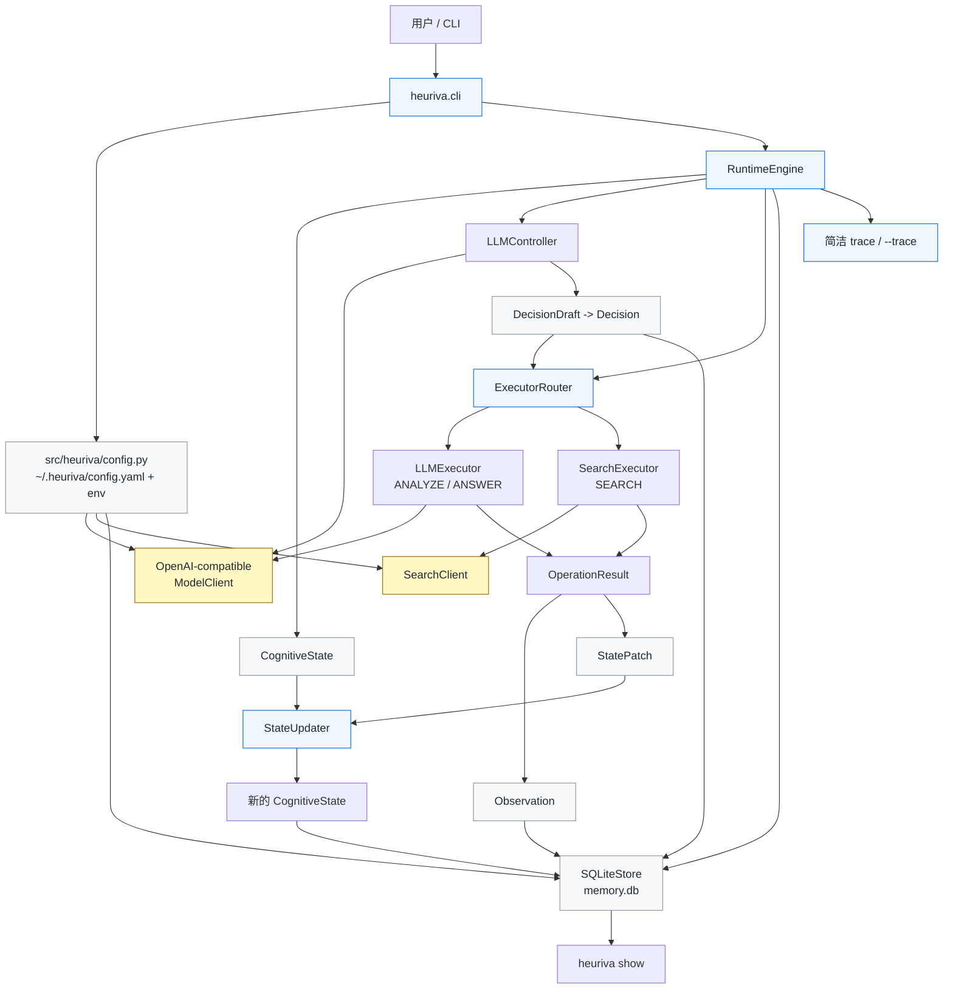

# Heuriva

**最后更新：** 2026-08-24

[English README](README.md)

Heuriva 是一个 Python CLI 形态的认知运行时，用来观察一个冻结权重的语言模型在显式状态、动态操作选择和可持久化轨迹帮助下，如何一步一步解决任务。

v0.2 保留 v0.1 的三操作 runtime，同时把重点推进到“更可解释、可恢复、可验证”：runtime 会判断每一步是否产生实质状态进展，会对低进展循环做确定性 guard，最终答案会用本地已保存 evidence 标签做 citation 校验，失败和诊断信息也会更清楚地落到轨迹里。

Heuriva 的重点不是做一个通用 Agent 框架，也不是先做 Python SDK，而是证明一条可检查的最小闭环：

- 任务状态是显式、结构化、可序列化的。
- Controller 每次只选择下一步认知操作，不生成固定长流程。
- operator selection 和 executor selection 分离。
- 每一步的 state、decision、observation 都能写入 SQLite。
- 用户可以通过 CLI 查看简洁 trace，也可以用 `--trace` 或 `show` 检查细节。

## 当前状态

这个仓库当前已经实现：

- Python package 与 `heuriva` CLI 入口
- `heuriva setup`、`heuriva doctor`、`heuriva run`、交互式 `heuriva`、`heuriva show`
- `~/.heuriva/` 下的本地配置
- OpenAI-compatible 非流式 `/v1/chat/completions` client
- v0.1 三个认知操作：`ANALYZE`、`SEARCH`、`ANSWER`
- LLM controller 的结构化 JSON 校验和一次修复重试
- 确定性 `ExecutorRouter`，把 operator 选择和 executor 选择分开
- LLM executor 和 search executor
- 基于 Pydantic v2 的不可变核心 schema
- SQLite trajectory store：schema version、foreign keys、唯一 step 约束、单步事务提交
- runtime progress policy：same-operator、no-material-progress 和 answer-reserve guard
- state delta：简洁 trace、`show --trace` 和 `show --json` 使用同一份结构化差异
- evidence-aware ANSWER prompt，以及基于已保存 evidence 的 `[S1]` citation validator
- `llm.max_retries` 控制的模型请求 retry，并记录 `attempt_count`
- search timeout 分类、stale running task 诊断和 opt-in live smoke tests
- 基于 fake model/search 的 v0.1/v0.2 自动化测试

当前明确没有实现：

- 程序性学习、policy lifecycle、replay、benchmark runner、evaluation tables
- vector database、dashboard、MCP、多 Agent、workflow builder
- shell/filesystem/Python executor、URL crawling
- daemon、任务恢复、并发队列
- provider-specific model client
- 独立 `VERIFY` operator；v0.2 仍只使用 `ANALYZE`、`SEARCH`、`ANSWER`

真实 Cursor-compatible endpoint 和真实公网搜索 smoke test 是可选验证，默认自动化测试会跳过，不访问网络。

## 架构图



## 安装与开发

```bash
python3 -m venv .venv
.venv/bin/pip install -e '.[dev]'
```

项目使用 `pyproject.toml` 声明依赖和 CLI entry point，要求 Python 3.11+。SQLite 使用 Python 标准库 `sqlite3`。

如果使用 uv：

```bash
.venv/bin/uv sync --extra dev
.venv/bin/uv run heuriva --help
```

## 快速开始

创建本地配置：

```bash
heuriva setup
```

检查配置、存储和模型端点：

```bash
heuriva doctor
heuriva doctor --probe
heuriva doctor --probe --probe-timeout 30
```

运行一个任务：

```bash
heuriva run --trace "分析这个项目是否值得做成产品"
heuriva run --json "分析这个项目是否值得做成产品"
```

长任务会把实时进度输出到 stderr。使用 `--json` 时，stdout 仍只保留最终机器可读 JSON，方便脚本解析；如果不需要实时状态，可以加 `--no-progress` 关闭。

失败任务会以非零退出码结束；只要已创建轨迹，stderr 会给出可恢复的 `heuriva show --trace <task_id>` 命令。Ctrl+C 返回 `130`；runtime 已创建 task 后，stderr 会打印完整 `task_id` 和对应的 `show --trace` 命令。模型端点失败会在进度和已保存 runtime event 中保留分类原因，例如 `connection_error` 或 `timeout`。

查看已落库轨迹：

```bash
heuriva show --trace <task_id>
heuriva show --json <task_id>
```

进入简单交互模式：

```bash
heuriva --trace
```

## 配置

`heuriva setup` 会创建：

```text
~/.heuriva/
├── config.yaml
├── .env
└── memory.db   # storage 首次打开时创建
```

默认模型配置：

```yaml
llm:
  base_url: http://localhost:8765/v1
  model: auto
  api_key_env: HEURIVA_API_KEY

runtime:
  max_steps: 20
  max_task_seconds: 600
  controller_repair_attempts: 1
  max_consecutive_failures: 3
  max_same_operator_streak: 3
  max_no_progress_steps: 2
  answer_reserve_steps: 2

tools:
  search:
    enabled: true
    max_results: 5
    timeout_seconds: 15
```

支持的环境变量覆盖：

- `HEURIVA_LLM_BASE_URL`
- `HEURIVA_LLM_MODEL`
- `HEURIVA_API_KEY`
- `HEURIVA_DB_PATH`

API key 只从环境变量读取，不写入 YAML、SQLite 或 trace。`memory.db` 是本地明文轨迹数据库，不是加密长期记忆。

默认启用搜索。搜索 query 会发送给第三方搜索服务；搜索结果摘要会被当作不可信外部数据，而不是模型可执行指令。

## 运行时流程

每个 task 会创建一个初始不可变 `CognitiveState`，然后进入 runtime loop，直到到达 `done`、`failed`、`max_steps_reached` 或 `interrupted`。

每个已提交 step 会写入：

- step 前的 state
- 校验后的 decision
- executor observation
- step 后的新 state
- trajectory step 关联行

Controller 只选择 operator。Runtime 自己的 `ExecutorRouter` 固定映射：

```text
ANALYZE -> llm
SEARCH  -> search
ANSWER  -> llm
```

每次 controller 决策前，runtime 会先执行确定性的 progress policy。它会在重复 operator、连续无实质进展，或进入 answer reserve 时缩窄可选 operator；每次 guard 介入都会写入 runtime event，并出现在实时进度里。

“实质进展”只包括结构化状态变化：新增 evidence、新增带 evidence refs 的 known item、解决 unknown/unresolved、新增 failure classification，或产生通过本地校验的最终答案。只更新 ID、history refs、step index、重复内容或仅提高 confidence，都不算实质进展。

如果当前 state 里已有 `SEARCH` evidence，成功 `ANSWER` 必须至少引用一个已保存标签，例如 `[S1]`。未知标签或缺少必需引用会形成 `answer_validation_error` observation，不会被标记成 `done`，也不会伪造来源。

## 验证

当前实现已跑过：

```bash
.venv/bin/ruff format --check .
.venv/bin/ruff check .
.venv/bin/mypy src tests
.venv/bin/pytest
.venv/bin/pytest --cov=heuriva --cov-report=term-missing
.venv/bin/uv sync --extra dev
.venv/bin/uv run pytest
.venv/bin/uv run heuriva --help
.venv/bin/python -m hatchling build
```

自动化测试覆盖 schema 不可变性、配置优先级、secret redaction、OpenAI-compatible client 错误处理、controller malformed JSON 修复、router 分离、state patch 应用、SQLite rollback、CLI setup/doctor、run 实时进度不会污染 JSON stdout、loop guard、state delta、citation validation/repair、model retry、search timeout、stale task 诊断，以及多条 fake runtime 路径：

- `ANALYZE -> SEARCH -> ANSWER`
- `ANALYZE -> ANSWER`
- `SEARCH -> ANSWER(validation error) -> ANSWER`

这证明 v0.2 机制在 fake model/search 下可运行，但不证明真实模型质量、真实搜索质量或 Cursor-compatible endpoint 稳定性。

真实验收应单独记录，并和自动化测试分开看。`doctor --probe` 成功只代表最小协议路径可用，不等同于完整多步任务 E2E 已验证。如果本地或 Cursor-compatible 模型冷启动较慢，可以用 `--probe-timeout 30` 放宽 doctor 探针的读取超时。

可选 live smoke tests 默认跳过，只有显式环境变量开启时才访问真实服务：

```bash
HEURIVA_RUN_LIVE_LLM_TESTS=1 .venv/bin/pytest tests/live/test_live_llm.py
HEURIVA_RUN_LIVE_SEARCH_TESTS=1 .venv/bin/pytest tests/live/test_live_search.py
```

## 接下来更适合做什么

v0.2 已完成代码实现和默认自动化验证。下一步更适合补独立 live 验收，而不是急着扩展新 operator。

优先级最高的是：

1. 用真实 Cursor-compatible endpoint 跑一次多步任务，确认 trace 中出现 material state delta。
2. 跑一次真实搜索任务，确认 final answer 的 `[S1]` 标签、`show --json` citation 和 state evidence URL 能对账。
3. 人工构造重复 `ANALYZE` 或无进展路径，确认 `loop_guard_applied` 对普通用户可见。
4. 复测慢 endpoint、坏 endpoint、search timeout 和 Ctrl+C，确认状态、退出码、task ID 和底层原因都可恢复检查。
5. 若至少两个真实任务在 citation validator 通过后仍稳定不满足 success criteria，再讨论后续 `VERIFY` 设计。

一句话：v0.2 先把“可解释、可恢复、可验证”做扎实；学习、多 Agent 或新的 operator 仍应等 evaluation 证据之后再做。
