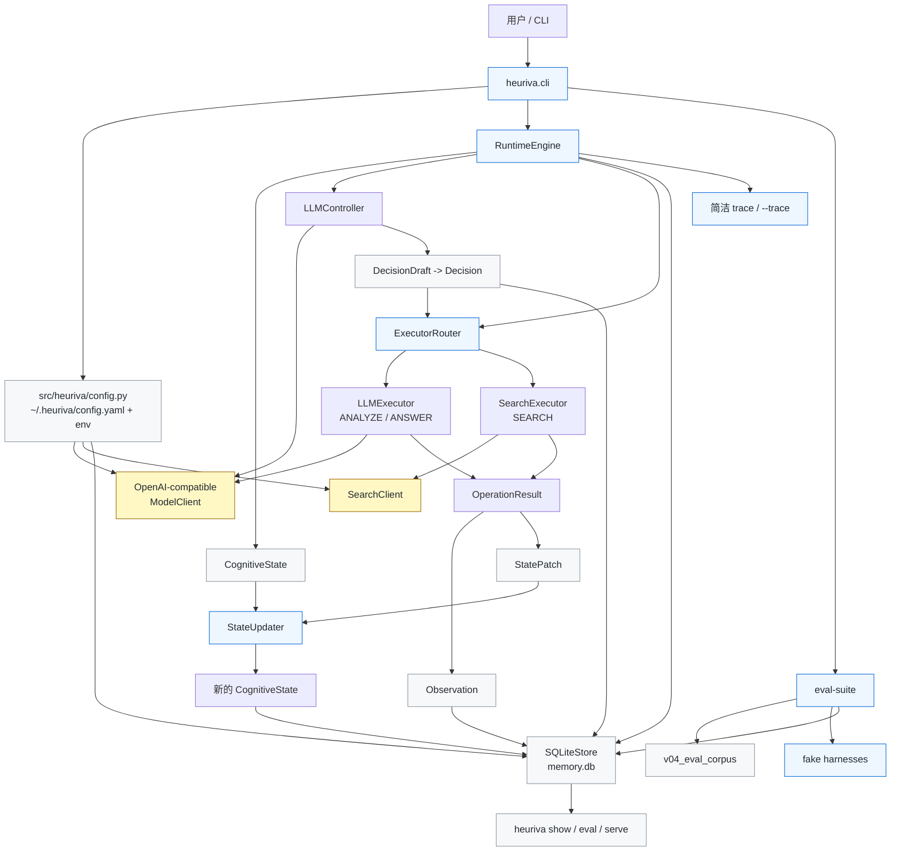

# Heuriva

**最后更新：** 2026-08-25

[English README](README.md)

Heuriva 是一个 Python CLI 形态的认知运行时，用来观察一个冻结权重的语言模型在显式状态、动态操作选择和可持久化轨迹帮助下，如何一步一步解决任务。

v0.7 在 v0.6 Task Contract Fidelity 之上增加 **Narrow Completion Lexicon**：共享、表驱动的中英质量词扩展，用于 deterministic completion（并对齐 relevance 匹配），用离线 harness 锁住关键词 FN 回潮。

v0.8 增加 **Local Trajectory Browser**：`heuriva serve` 在本机只读打开 SQLite，用最小 Web 面检视任务列表、合同、citation、completion_assessment（含 kind）和 eval_runs / disagreement。默认不调模型、不写轨迹、不改 quality 默认值。

v0.8 仍只使用 `ANALYZE`、`SEARCH`、`ANSWER`。fresh judge 结果是带 provenance 的 opt-in 模型评估，不会改写原 trajectory，也不能当成客观正确率证明。fake/synthetic suite 结果只是回归信号，不是产品证明。

Heuriva 的重点不是做一个通用 Agent 框架，也不是先做 Python SDK，而是证明一条可检查的最小闭环：

- 任务状态是显式、结构化、可序列化的。
- Controller 每次只选择下一步认知操作，不生成固定长流程。
- operator selection 和 executor selection 分离。
- 每一步的 state、decision、observation 都能写入 SQLite。
- 用户可以通过 CLI 查看简洁 trace，也可以用 `--trace` 或 `show` 检查细节。
- v0.3 质量信号可以通过 corpus 与 `eval-suite` 跨 case 复验。
- v0.5 可对 saved trajectory 做显式 opt-in fresh judging，并报告 disagreement。
- v0.6 可用结构化 TaskContract 声明精确完成合同，并在 ANSWER / assessor 两侧保持一致。
- v0.7 用共享 lexicon 让中英质量词匹配可回归，且不等于默认 semantic enforce。
- v0.8 提供本机只读 Trajectory Browser，方便复盘质量信号；**不是**远程 dashboard，也**不是** VERIFY。

## 当前状态

发布定性：v0.8 落地本机只读轨迹浏览器。默认 quality mode 仍是 `observe`；`recommend_enforce` 与 `enter_verify_design` 仍为 false，除非 §54 门槛被单独满足并记录。本地开发目录里的 `docs/` 有 roadmap 和 promotion 笔记，默认不上传 GitHub。live checklist 仍是 Git ignored 的本地文件，因为里面有机器相关 task IDs。

这个仓库当前已经实现：

- Python package 与 `heuriva` CLI 入口
- `heuriva setup`、`heuriva doctor`、`heuriva run`、交互式 `heuriva`、`heuriva show`
- 本机只读 `heuriva serve` 轨迹浏览器（列表 + 详情；UI 不调模型）
- 只读 `heuriva eval` 和 `heuriva eval --json`
- 显式 opt-in 的 `heuriva eval --judge`：带 provenance、disagreement bucket、promotion 建议、VERIFY gate；eval run 与 trajectory 分表保存
- 默认离线的 `heuriva eval-suite` / `heuriva eval-suite --json`
- 跨 case 聚合报告：pass/fail/missing/skipped、evidence level 分层、search/citation/completion 汇总、promotion 统计与 VERIFY gate
- forced harness：forbidden-search、duplicate-query、enforce block、bounded repair、citation 与 completion 分离、`exact_answer` 多余文本、`must_not_include`、legacy 字符串 criterion 兼容、中文 safety/tradeoffs lexicon
- 共享窄域 quality lexicon（completion 与 relevance 共用扩展）
- 结构化 task criteria：`must_include` / `must_not_include` / `exact_answer`（CLI flag 与 `kind:value` DSL；裸 `--criterion` 仍可用）
- 按 kind 的确定性 completion assessment（结果带 kind/reason）；ANSWER prompt 展示同一份结构化合同
- 通过 `heuriva --version` 和 `heuriva doctor` 查看版本
- `~/.heuriva/` 下的本地配置
- OpenAI-compatible 非流式 `/v1/chat/completions` client
- 三个认知操作：`ANALYZE`、`SEARCH`、`ANSWER`
- LLM controller 的结构化 JSON 校验、`success_criteria` 规范化、SEARCH intent 字段和一次修复重试
- 确定性 `ExecutorRouter`，把 operator 选择和 executor 选择分开
- LLM executor 和 search executor
- 基于 Pydantic v2 的不可变核心 schema，以及不可变 `TaskContract`、eval corpus 与 judge provenance schema
- SQLite trajectory store：schema v2（新增 `eval_runs`）、foreign keys、唯一 step 约束、单步事务提交
- runtime progress policy：same-operator、no-material-progress 和 answer-reserve guard
- runtime search quality guard：用户禁止搜索、local/provided source scope、重复 query、search budget、缺少搜索意图、连续无相关结果
- search executor metadata：区分 raw candidate、accepted evidence、rejected candidate 和确定性 relevance verdict
- state delta：简洁 trace、`show --trace` 和 `show --json` 使用同一份结构化差异
- evidence-aware ANSWER prompt，以及基于已保存 evidence 的 `[S1]` citation validator
- 确定性 task-level completion assessment：支持 `off`/`observe`/`enforce`，限制 repair 次数，并覆盖少量常见中英文质量词等价匹配
- `llm.max_retries` 控制的模型请求 retry，并记录 `attempt_count`
- search timeout 分类、stale running task 诊断和 opt-in live smoke tests
- 基于 fake model/search 的 v0.1 到 v0.8 自动化测试（含只读 browser 查询路径）

当前明确没有实现：

- 程序性学习、policy lifecycle、replay、dashboard、MCP、多 Agent、workflow builder
- shell/filesystem/Python executor、URL crawling
- daemon、任务恢复、并发队列
- provider-specific model client
- 独立 `VERIFY` operator（设计门槛仍未满足；Post-v0.5 live 证据未达到 ≥2 个不可用 TaskContract 修复的 leak）
- 默认启用 fresh judge；`--judge` 必须显式 opt-in
- 默认 semantic enforce；promotion 规则要求在 live corpus 证据足够前保持 `observe`

真实 Cursor-compatible endpoint 和真实公网搜索 smoke test 是可选验证，默认自动化测试会跳过，不访问网络。

## 架构图



## 安装与开发

```bash
python3 -m venv .venv
.venv/bin/pip install -e '.[dev]'
```

项目使用 `pyproject.toml` 声明依赖和 CLI entry point，要求 Python 3.11+。SQLite 使用 Python 标准库 `sqlite3`。

如果使用 uv：

```bash
.venv/bin/uv sync --extra dev
.venv/bin/uv run heuriva --help
```

## 快速开始

创建本地配置：

```bash
heuriva --version
heuriva setup
```

检查配置、存储和模型端点：

```bash
heuriva doctor
heuriva doctor --probe
heuriva doctor --probe --probe-timeout 30
```

运行一个任务：

```bash
heuriva run --trace "分析这个项目是否值得做成产品"
heuriva run --json "分析这个项目是否值得做成产品"
heuriva run --criterion "提到取舍" --search-policy forbidden \
  "只基于本地项目方向做说明，不访问 Web"
heuriva run --criterion-exact 'OK' "只返回 OK，不要其他文字。"
heuriva run --criterion 'exact_answer:OK' --criterion-must-not 'SECRET' \
  "只返回 OK"
```

长任务会把实时进度输出到 stderr。使用 `--json` 时，stdout 仍只保留最终机器可读 JSON，方便脚本解析；如果不需要实时状态，可以加 `--no-progress` 关闭。

失败任务会以非零退出码结束；只要已创建轨迹，stderr 会给出可恢复的 `heuriva show --trace <task_id>` 命令。Ctrl+C 返回 `130`；runtime 已创建 task 后，stderr 会打印完整 `task_id` 和对应的 `show --trace` 命令。模型端点失败会在进度和已保存 runtime event 中保留分类原因，例如 `connection_error` 或 `timeout`。

查看已落库轨迹，启动本机只读浏览器，或运行离线 eval suite：

```bash
heuriva show --trace <task_id>
heuriva show --json <task_id>
heuriva serve
heuriva serve --db ~/.heuriva/memory.db --port 8766
heuriva eval <task_id>
heuriva eval --json <task_id>
heuriva eval --judge <task_id>
heuriva eval --judge --json <task_id>
heuriva eval-suite
heuriva eval-suite --json
```

`heuriva serve` 启动 **仅本机、只读** 的轨迹浏览器，读取配置的 SQLite（或 `--db`）。可看任务列表与详情中的合同、citation、completion_assessment（含 kind）、steps，以及可选的 eval_runs / disagreement。UI 不调模型、不改写 `trajectory_steps`。绑定非 `127.0.0.1` 需要显式 `--host` 并会警告——这是本地 inspector，不是远程多租户 dashboard。

`heuriva eval` 默认只读，不 replay task，也不会调用模型。它会汇总已保存的 task contract、search guard、raw/accepted/rejected evidence 数量、citation 状态、completion verdict 和 parse warning 计数。

`heuriva eval --judge` 是显式 opt-in。它会调用配置的 OpenAI-compatible 模型（加有界 parse repair），记录 model / prompt-hash / timestamp provenance，对比 deterministic completion verdict 产出 disagreement，并可把结果写入独立的 `eval_runs` 表而不改写原 trajectory。可用 `--no-persist-eval` 跳过持久化。judge 结果不能当作客观真理。

`heuriva eval-suite` 默认只跑 deterministic/fake harness，不改写用户 `memory.db`。`stored_live` 在本机有 task_id 时只读汇总，否则标记为 `missing` 而不是 `fail`。`fresh_live` 必须显式 `--include-fresh-live` 或 `HEURIVA_EVAL_SUITE_FRESH_LIVE=1`。suite 报告也包含 promotion 建议与 VERIFY 设计门槛结论。

进入简单交互模式：

```bash
heuriva --trace
```

## 配置

`heuriva setup` 会创建：

```text
~/.heuriva/
├── config.yaml
├── .env
└── memory.db   # storage 首次打开时创建
```

默认模型配置：

```yaml
llm:
  base_url: http://localhost:8765/v1
  model: auto
  api_key_env: HEURIVA_API_KEY

runtime:
  max_steps: 20
  max_task_seconds: 600
  controller_repair_attempts: 1
  max_consecutive_failures: 3
  max_same_operator_streak: 3
  max_no_progress_steps: 2
  answer_reserve_steps: 2

quality:
  evidence_relevance_mode: observe
  completion_check_mode: observe
  max_search_steps: 3
  max_no_relevant_search_steps: 1
  max_completion_repairs: 1

tools:
  search:
    enabled: true
    max_results: 5
    timeout_seconds: 15
```

支持的环境变量覆盖：

- `HEURIVA_LLM_BASE_URL`
- `HEURIVA_LLM_MODEL`
- `HEURIVA_API_KEY`
- `HEURIVA_DB_PATH`
- `HEURIVA_EVAL_SUITE_FRESH_LIVE`

API key 只从环境变量读取，不写入 YAML、SQLite 或 trace。`memory.db` 是本地明文轨迹数据库，不是加密长期记忆。

默认启用搜索。搜索 query 会发送给第三方搜索服务；搜索结果摘要会被当作不可信外部数据，而不是模型可执行指令。

quality mode 支持 `off`、`observe`、`enforce`。默认仍是 `observe`。`enforce` 可供本地实验和 harness 覆盖，但 v0.5 不建议默认开启 semantic enforce：deterministic/fake suite 全绿只是必要条件，还需要 live corpus review 与 judge disagreement 评估。

## 运行时流程

每个 task 会创建一个带稳定 `TaskContract` 的初始不可变 `CognitiveState`，然后进入 runtime loop，直到到达 `done`、`failed`、`max_steps_reached` 或 `interrupted`。

每个已提交 step 会写入：

- step 前的 state
- 校验后的 decision
- executor observation
- step 后的新 state
- trajectory step 关联行

Controller 只选择 operator。Runtime 自己的 `ExecutorRouter` 固定映射：

```text
ANALYZE -> llm
SEARCH  -> search
ANSWER  -> llm
```

每次 controller 决策前，runtime 会先执行确定性的 progress policy。它会在重复 operator、连续无实质进展，或进入 answer reserve 时缩窄可选 operator；每次 guard 介入都会写入 runtime event，并出现在实时进度里。

“实质进展”只包括结构化状态变化：新增 evidence、新增带 evidence refs 的 known item、解决 unknown/unresolved、新增 failure classification，或产生通过本地校验的最终答案。只更新 ID、history refs、step index、重复内容或仅提高 confidence，都不算实质进展。

如果当前 state 里已有 `SEARCH` evidence，成功 `ANSWER` 必须至少引用一个已保存标签，例如 `[S1]`。未知标签或缺少必需引用会形成 `answer_validation_error` observation，不会被标记成 `done`，也不会伪造来源。

SEARCH decision 需要带 `query`、`evidence_need`、`expected_signal` 和 `source_scope`。在真正调用搜索 provider 之前，runtime 可以因为用户禁止搜索、controller 标记 local/provided source scope、重复 query、search budget 耗尽，或最近搜索没有 accepted evidence 而拦截 Web 搜索。

搜索结果会先作为 raw candidate 进入 observation metadata；只有 accepted evidence 会写入 state，并且只有它能算作实质进展。completion assessment 与 citation validation 是两层判断：citation 只证明标签能回映射到已保存 evidence，completion assessment 才检查稳定 criteria 和 required evidence 是否满足。

## 验证

当前实现已跑过：

```bash
.venv/bin/ruff format --check .
.venv/bin/ruff check .
.venv/bin/mypy src tests
.venv/bin/pytest
.venv/bin/pytest --cov=heuriva --cov-report=term-missing
.venv/bin/python -m hatchling build
.venv/bin/heuriva --version
.venv/bin/heuriva eval --help
.venv/bin/heuriva eval-suite --help
.venv/bin/heuriva serve --help
.venv/bin/heuriva eval-suite --json
```

自动化测试覆盖 schema 不可变性、配置优先级、secret redaction、OpenAI-compatible client 错误处理、controller malformed JSON 修复、controller `success_criteria` 规范化、router 分离、state patch 应用、SQLite rollback、CLI setup/doctor、run 实时进度不会污染 JSON stdout、loop guard、state delta、citation validation/repair、model retry、search timeout、stale task 诊断、task contract、search guard、evidence relevance 对账、eval evidence 不重复计数、completion enforce 模式、bounded completion repair、常见中英文 criterion 匹配、结构化 `exact_answer` / `must_not_include` / legacy 字符串 criterion、只读 eval 输出、eval corpus schema、离线 eval-suite 报告、stored-live missing/summary 行为、只读 trajectory browser 列表/详情与不写 steps，以及多条 fake runtime 路径：

- `ANALYZE -> SEARCH -> ANSWER`
- `ANALYZE -> ANSWER`
- `SEARCH -> ANSWER(validation error) -> ANSWER`

默认 pytest 应保持绿色（含 2 个 skipped live tests）。package build 生成 `heuriva-0.8.0` sdist 和 wheel。这证明 v0.8 Local Trajectory Browser 与既有合同 / lexicon / judging / VERIFY gate 在 fake harness 下可复验，但不证明真实模型质量、真实搜索质量或 Cursor-compatible endpoint 稳定性。

真实验收应单独记录，并和自动化测试分开看。`doctor --probe` 成功只代表最小协议路径可用，不等同于完整多步任务 E2E 已验证。如果本地或 Cursor-compatible 模型冷启动较慢，可以用 `--probe-timeout 30` 放宽 doctor 探针的读取超时。

可选 live smoke tests 默认跳过，只有显式环境变量开启时才访问真实服务：

```bash
HEURIVA_RUN_LIVE_LLM_TESTS=1 .venv/bin/pytest tests/live/test_live_llm.py
HEURIVA_RUN_LIVE_SEARCH_TESTS=1 .venv/bin/pytest tests/live/test_live_search.py
```

## 接下来更适合做什么

v0.8 Local Trajectory Browser 已落地。VERIFY 仍受 §54 约束且默认关闭；citation 早已存在，UI 只做展示。

提醒：

- **Citation**（`[S1]` 校验）很早已经实现，不要再当成缺口。
- **VERIFY** 仍因 §54 证据不足保持关闭；UI 只帮助复盘，不降低开闸门槛。

优先级：

1. 在 ignored checklist 里完成本机真实 `memory.db` 的 UI 验收。
2. 继续积累不可合同修复 leak（若目标仍是 VERIFY）；证据不够就不要开闸。
3. 不要把 UI 浏览当成新的 VERIFY 证据，也不要默认打开 semantic enforce。
