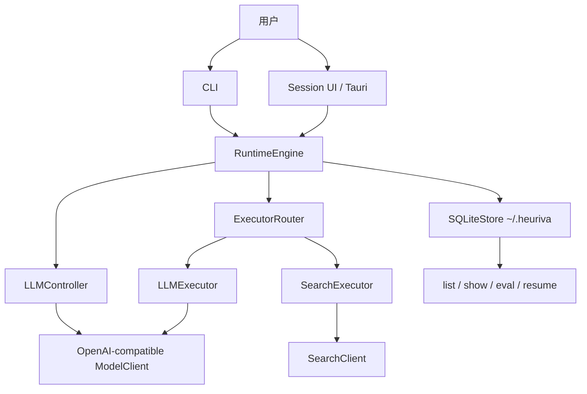

<div align="center">


# Heuriva

**本机优先的语言模型认知运行时**

显式状态 · 动态操作选择 · 可检视 SQLite 轨迹 · 安全续跑

<br/>

[](https://github.com/ingeniousfrog/Heuriva/actions/workflows/ci.yml)
[](https://github.com/ingeniousfrog/Heuriva/releases)


<br/>

[⬇ 下载](#桌面安装包-macos--windows) · [⚡ 快速开始](#快速开始) · [📖 English](README.md)

<br/>

[English](README.md) · **简体中文**

</div>

---

Heuriva 回答的是：**「这个模型是怎样一步一步解完这道题的？」**  
用一套可检查的小认知闭环：不可变状态、每步只选一个操作（`ANALYZE` / `SEARCH` / `ANSWER`）、合同化完成检查，以及完整落在本地 SQLite 的轨迹——可列表、检视、评估、安全续跑。

它**不是**多通道 Agent 网关，不是远程 dashboard，也不是 VERIFY 产品。日常入口是 `heuriva` CLI 与本机 **Session UI**（`heuriva serve`）。可选 **Tauri** 安装包只是同一 UI 的薄壳。

| | 能力 | 你得到什么 |
|:--:|------|------------|
| ▶ | **[运行](#快速开始)** | 在 ANALYZE → SEARCH → ANSWER 间动态选择（不是写死流水线） |
| 🖥 | **[Session UI](#session-ui)** | 本机提问 / 进度 / 续跑；可选桌面 `.dmg` / `.exe` |
| 📦 | **[轨迹](#架构设计)** | 每一步已提交的 state / decision / observation 持久化 |
| ↩ | **[续跑](#快速开始)** | Ctrl+C 或失败后继续——只追加，永不改写历史 |
| ✓ | **[合同与评估](#快速开始)** | 结构化完成条件、引用校验、只读 `eval` / 可选 judge |

## 桌面安装包 (macOS / Windows)

安装包由 GitHub Actions 构建，发布在 [Releases](https://github.com/ingeniousfrog/Heuriva/releases)。

| 平台 | 产物 |
|------|------|
| macOS Apple Silicon | `*.dmg` / `.app.zip`（`aarch64-apple-darwin`） |
| Windows x64 | NSIS `.exe` / MSI |

```bash
# 或本地构建
./scripts/build-desktop.sh           # macOS
./scripts/build-desktop-windows.sh   # Windows（尽力支持）
```

未签名包首次打开可能触发 Gatekeeper / SmartScreen。配置与数据库仍在 `~/.heuriva`（与 CLI 相同）。详见 [`desktop/README.md`](desktop/README.md)。

## 快速开始

```bash
python3 -m venv .venv
.venv/bin/pip install -e '.[dev]'

heuriva setup
heuriva doctor --probe
heuriva run --trace "分析这个项目是否值得做成产品"
```

默认对接 OpenAI-compatible 端点（`http://localhost:8765/v1`，`model: auto`）。可用 `HEURIVA_LLM_BASE_URL` / `HEURIVA_LLM_MODEL` 指向任意兼容服务。

```bash
heuriva list                     # 最近任务
heuriva show --trace <task_id>
heuriva serve                    # Session UI（发任务 / 列表 / 续跑）
heuriva serve --read-only        # 仅只读检视
heuriva resume <task_id>         # 中断 / 失败后续跑
heuriva eval <task_id>           # 只读质量摘要
heuriva eval --judge <task_id>   # 显式 opt-in 模型评判
heuriva eval-suite               # 默认离线回归套件
```

结构化完成合同（可选）：

```bash
heuriva run --criterion-exact 'OK' "只返回 OK，不要其他文字。"
heuriva run --criterion 'must_include:取舍' --search-policy forbidden \
  "只基于本地项目方向说明，不访问 Web"
```

## Session UI

```bash
heuriva serve   # http://127.0.0.1:8766/
```

- 提问、看实时 Activity、Interrupt（等同 Ctrl+C）、首页 Resume
- 浏览最近任务，打开完整轨迹与最终答案
- 设置（LLM Base URL / Model）写入 `~/.heuriva/config.yaml`，下一次运行生效

桌面端启动同一 `heuriva serve` sidecar 并用 WebView 打开——没有远程多租户面。

## 架构设计

```text
CLI / Session UI / Tauri 壳
  → RuntimeEngine
  → CognitiveState + TaskContract
  → LLMController  （每步只选一个 operator）
  → ExecutorRouter （ANALYZE/ANSWER → llm，SEARCH → search）
  → 校验（搜索 / 引用 / 完成度）
  → StateUpdater → SQLiteStore（单步原子提交）
  → list / show / eval / resume
```



### 设计不变量

| 关注点 | 做法 |
| --- | --- |
| 状态 | 不可变快照；patch 不能改写 goal / TaskContract |
| 控制 | Controller 只选 operator；Router 映射 executor |
| 证据 | 只有 accepted evidence 算实质进展 |
| 答案 | `[S1]` 等引用必须映射到已保存 evidence |
| 质量 | 确定性检查 + 可选 assessor/judge；默认 `observe` |
| 持久化 | 每个已提交 step 一次 SQLite 事务 |
| 恢复 | 装载最后提交状态；只追加；永不改写历史 |

### 模块职责

| 区域 | 责任 |
| --- | --- |
| `cli.py` | `setup`、`doctor`、`run`、`resume`、`list`、`show`、`eval`、`eval-suite`、`serve` |
| `runtime/` | 循环、guard、校验、resume 资格、engine factory |
| `controller/` | 结构化 operator 选择与 JSON 修复 |
| `executors/` | ANALYZE / ANSWER（LLM）与 SEARCH |
| `storage/` | SQLite 轨迹与 `eval_runs` |
| `web/` | 本机 Session UI + 轨迹检视 |
| `desktop/` | 可选 Tauri 2 壳 + Python sidecar |

## 与 OpenClaw、Hermes Agent 的异同

| | Heuriva | OpenClaw | Hermes Agent |
| --- | --- | --- | --- |
| 主职 | 显式认知运行时 + 轨迹可复验 | 网关 / 多通道控制面 | Agent 优先运行时 + 技能学习 |
| 交互面 | CLI + 本机 Session UI（+ 可选 Tauri） | 大量 IM 通道 + CLI | TUI / 桌面（+ 网关） |
| 能力面 | 固定三操作：ANALYZE / SEARCH / ANSWER | 大技能生态 | 内置工具 + Agent 自写技能 |
| 「记忆」 | SQLite 轨迹（过程证据） | 会话 / 文件 / 生态记忆 | 持久记忆 + 程序性技能 |
| 学习 | 非目标（记录 ≠ 学会） | 人工技能 / 市场 | 自改进程序性技能 |
| 更适合 | 可复现轨迹、合同、评估、安全续跑 | 在用户已有聊天入口挂 Agent | 随使用沉淀可复用技能 |

**选 Heuriva**：你关心每一步为何被选中、证据是否被接受、答案是否满足合同、中断后能否在不改写历史上续跑。

## 明确不做的边界

- 默认不开 `VERIFY`、默认不开语义 `enforce`、默认不开 fresh judge
- 不做 MCP、多 Agent、shell/文件系统/Python executor，也不做超出搜索 API 的爬虫
- 不做远程多租户 dashboard（Session / Tauri 仅本机）
- 不把程序性学习 / policy lifecycle 当作已交付产品能力

## 开发

需要 Python 3.11+。

```bash
.venv/bin/pip install -e '.[dev]'
.venv/bin/ruff format --check .
.venv/bin/ruff check .
.venv/bin/mypy src tests
.venv/bin/pytest
.venv/bin/heuriva --version
```

真实 LLM / 搜索测试需显式开启：

```bash
HEURIVA_RUN_LIVE_LLM_TESTS=1 .venv/bin/pytest tests/live/test_live_llm.py
HEURIVA_RUN_LIVE_SEARCH_TESTS=1 .venv/bin/pytest tests/live/test_live_search.py
```

每次 push/PR 跑 CI。推送 `v*` 标签会构建并发布桌面安装包：

```bash
git tag v1.0.0
git push origin v1.0.0
```

## 许可证

MIT。
