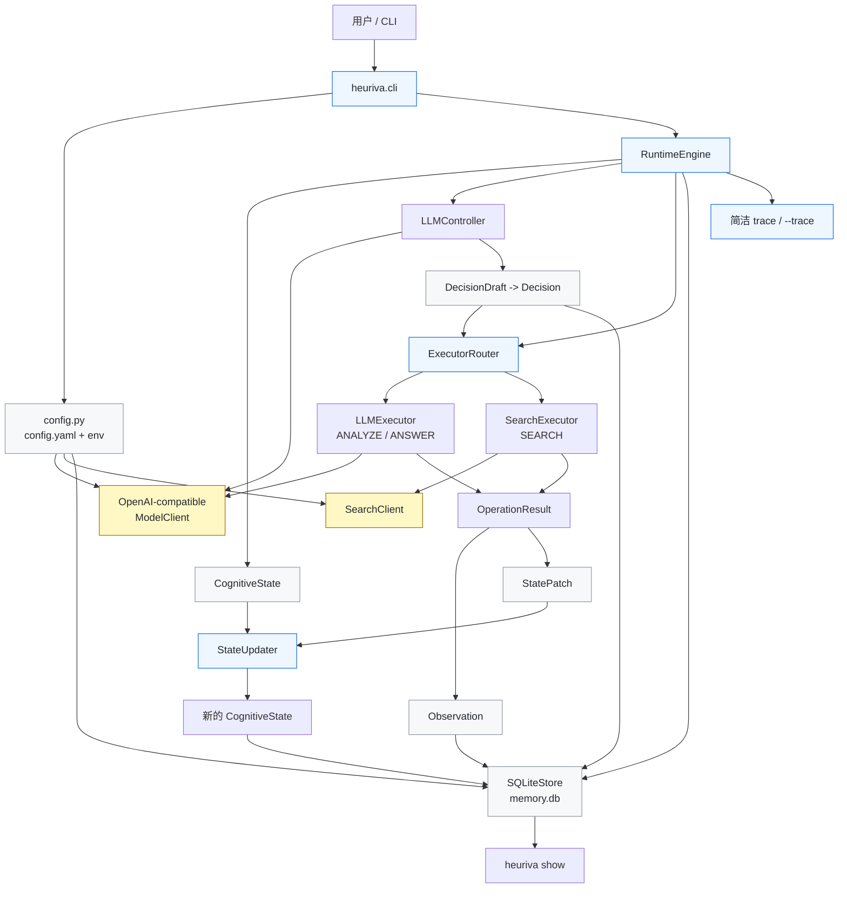

# Heuriva

**最后更新：** 2026-08-24

[English README](README.md)

Heuriva 是一个 Python CLI 形态的认知运行时，用来观察一个冻结权重的语言模型在显式状态、动态操作选择和可持久化轨迹帮助下，如何一步一步解决任务。

v0.1 的重点不是做一个通用 Agent 框架，也不是先做 Python SDK，而是证明一条最小闭环：

- 任务状态是显式、结构化、可序列化的。
- Controller 每次只选择下一步认知操作，不生成固定长流程。
- operator selection 和 executor selection 分离。
- 每一步的 state、decision、observation 都能写入 SQLite。
- 用户可以通过 CLI 查看简洁 trace，也可以用 `--trace` 或 `show` 检查细节。

## 当前状态

这个仓库当前已经实现：

- Python package 与 `heuriva` CLI 入口
- `heuriva setup`、`heuriva doctor`、`heuriva run`、交互式 `heuriva`、`heuriva show`
- `~/.heuriva/` 下的本地配置
- OpenAI-compatible 非流式 `/v1/chat/completions` client
- v0.1 三个认知操作：`ANALYZE`、`SEARCH`、`ANSWER`
- LLM controller 的结构化 JSON 校验和一次修复重试
- 确定性 `ExecutorRouter`，把 operator 选择和 executor 选择分开
- LLM executor 和 search executor
- 基于 Pydantic v2 的不可变核心 schema
- SQLite trajectory store：schema version、foreign keys、唯一 step 约束、单步事务提交
- 简洁 trace 和详细 trace
- 基于 fake model/search 的自动化测试

v0.1 明确没有实现：

- 程序性学习、policy lifecycle、replay、benchmark runner、evaluation tables
- vector database、dashboard、MCP、多 Agent、workflow builder
- shell/filesystem/Python executor、URL crawling
- daemon、任务恢复、并发队列
- provider-specific model client

真实 Cursor endpoint 和真实公网搜索 smoke test 是可选验证，不属于默认自动化测试结果。

## 架构图



## 安装与开发

```bash
python3 -m venv .venv
.venv/bin/pip install -e '.[dev]'
```

项目使用 `pyproject.toml` 声明依赖和 CLI entry point，要求 Python 3.11+。SQLite 使用 Python 标准库 `sqlite3`。

如果使用 uv：

```bash
.venv/bin/uv sync --extra dev
.venv/bin/uv run heuriva --help
```

## 快速开始

创建本地配置：

```bash
heuriva setup
```

检查配置、存储和模型端点：

```bash
heuriva doctor
heuriva doctor --probe
heuriva doctor --probe --probe-timeout 30
```

运行一个任务：

```bash
heuriva run --trace "分析这个项目是否值得做成产品"
heuriva run --json "分析这个项目是否值得做成产品"
```

长任务会把实时进度输出到 stderr。使用 `--json` 时，stdout 仍只保留最终机器可读 JSON，方便脚本解析；如果不需要实时状态，可以加 `--no-progress` 关闭。

查看已落库轨迹：

```bash
heuriva show --trace <task_id>
heuriva show --json <task_id>
```

进入简单交互模式：

```bash
heuriva --trace
```

## 配置

`heuriva setup` 会创建：

```text
~/.heuriva/
├── config.yaml
├── .env
└── memory.db   # storage 首次打开时创建
```

默认模型配置：

```yaml
llm:
  base_url: http://localhost:8765/v1
  model: auto
  api_key_env: HEURIVA_API_KEY
```

支持的环境变量覆盖：

- `HEURIVA_LLM_BASE_URL`
- `HEURIVA_LLM_MODEL`
- `HEURIVA_API_KEY`
- `HEURIVA_DB_PATH`

API key 只从环境变量读取，不写入 YAML、SQLite 或 trace。`memory.db` 是本地明文轨迹数据库，不是加密长期记忆。

默认启用搜索。搜索 query 会发送给第三方搜索服务；搜索结果摘要会被当作不可信外部数据，而不是模型可执行指令。

## 运行时流程

每个 task 会创建一个初始不可变 `CognitiveState`，然后进入 runtime loop，直到到达 `done`、`failed`、`max_steps_reached` 或 `interrupted`。

每个已提交 step 会写入：

- step 前的 state
- 校验后的 decision
- executor observation
- step 后的新 state
- trajectory step 关联行

Controller 只选择 operator。Runtime 自己的 `ExecutorRouter` 固定映射：

```text
ANALYZE -> llm
SEARCH  -> search
ANSWER  -> llm
```

当只剩最后一步时，runtime 只暴露 `ANSWER`，强制尝试收束，避免无限分析或搜索。

## 验证

当前实现已跑过：

```bash
.venv/bin/ruff format --check .
.venv/bin/ruff check .
.venv/bin/mypy src tests
.venv/bin/pytest
.venv/bin/pytest --cov=heuriva --cov-report=term-missing
.venv/bin/uv sync --extra dev
.venv/bin/uv run pytest
.venv/bin/uv run heuriva --help
.venv/bin/python -m hatchling build
```

自动化测试覆盖 schema 不可变性、配置优先级、secret redaction、OpenAI-compatible client 错误处理、controller malformed JSON 修复、router 分离、state patch 应用、SQLite rollback、CLI setup/doctor、run 实时进度不会污染 JSON stdout，以及两条不同 fake runtime 路径：

- `ANALYZE -> SEARCH -> ANSWER`
- `ANALYZE -> ANSWER`

覆盖率当前为 80%。这证明 v0.1 机制在 fake model/search 下可运行，但不证明真实模型质量、真实搜索质量或 Cursor endpoint 稳定性。

真实验收应单独记录，并和自动化测试分开看。`doctor --probe` 成功只代表最小协议路径可用，不等同于完整多步任务 E2E 已验证。如果本地或 Cursor-compatible 模型冷启动较慢，可以用 `--probe-timeout 30` 放宽 doctor 探针的读取超时。

## 接下来更适合做什么

我建议下一步先做“真实运行验收 + v0.1 缺口收口”，暂时不要急着扩展新 operator。

优先级最高的是：

1. 按本地验收清单跑一次真实 Cursor endpoint、完整 `heuriva run --json` 和 `heuriva show --trace <task_id>`，确认能落库至少两个 step。
2. 把 live 验证结果记录到文档里：endpoint、日期、命令、退出码、task_id、是否有真实搜索 URL。
3. 补齐计划里还没有完全产品化的诊断项，尤其是 stale running task 统计、`max_retries` 的实际使用、search timeout 的真实传递。
4. 增加 optional live tests，让 `HEURIVA_RUN_LIVE_LLM_TESTS=1` 和 `HEURIVA_RUN_LIVE_SEARCH_TESTS=1` 真正触发可跳过的 smoke tests。
5. 再决定是否进入 v0.2：更好的 answer citation 约束、更清晰的 trace diff、少量真实任务 fixtures，而不是先做学习或多 Agent。

一句话：先证明这个 v0.1 在真实本机模型和真实搜索下可持续跑通，再谈更“聪明”的机制。
