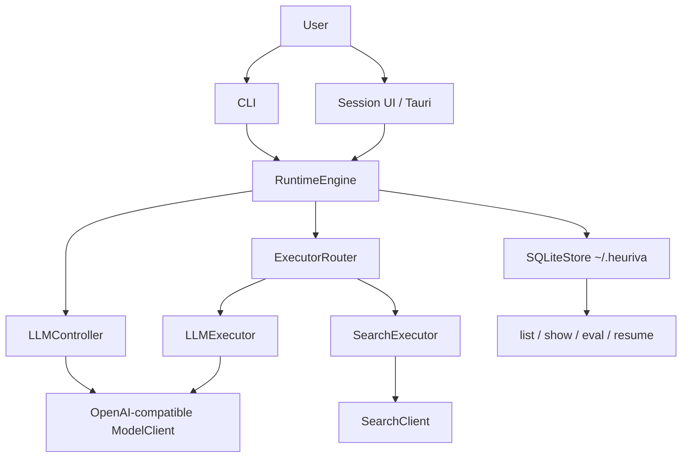

<div align="center">


# Heuriva

**Local-first cognitive runtime for language models**

Explicit state · dynamic operators · inspectable SQLite trajectories · safe resume

<br/>

[](https://github.com/ingeniousfrog/Heuriva/actions/workflows/ci.yml)
[](https://github.com/ingeniousfrog/Heuriva/releases)

[](LICENSE)

<br/>

[⬇ Download](#desktop-macos--windows) · [⚡ Quick start](#quick-start) · [📖 简体中文](README-CN.md)

<br/>

**English** · [简体中文](README-CN.md)

</div>

---

Heuriva answers **“how did this model solve the task, step by step?”** with a small, inspectable cognitive loop: immutable state, one operator per step (`ANALYZE` / `SEARCH` / `ANSWER`), contract-aware completion checks, and a full local SQLite trajectory you can list, show, evaluate, and safely resume.

It is **not** a multi-channel agent gateway, not a remote dashboard, and not a VERIFY-heavy product. Day-to-day entry points are the `heuriva` CLI and the **localhost Session UI** (`heuriva serve`). Optional **Tauri** installers are a thin shell around that same UI.

| | Capability | What you get |
|:--:|------------|--------------|
| ▶ | **[Run](#quick-start)** | Dynamic loop over ANALYZE → SEARCH → ANSWER (not a fixed pipeline) |
| 🖥 | **[Session UI](#session-ui)** | Localhost ask / progress / resume; optional desktop `.dmg` / `.exe` |
| 📦 | **[Trajectory](#architecture)** | Every committed step persisted: state, decision, observation |
| ↩ | **[Resume](#quick-start)** | Continue after Ctrl+C or failure — append only, never rewrite history |
| ✓ | **[Contracts & eval](#quick-start)** | Structured criteria, citations vs evidence, read-only `eval` / opt-in judge |

## Desktop (macOS / Windows)

Latest: **[v1.0.2](https://github.com/ingeniousfrog/Heuriva/releases/tag/v1.0.2)** · all builds on [Releases](https://github.com/ingeniousfrog/Heuriva/releases)

| Platform | Download |
|----------|----------|
| **macOS** (Apple Silicon) | [Heuriva_1.0.2_aarch64.dmg](https://github.com/ingeniousfrog/Heuriva/releases/download/v1.0.2/Heuriva_1.0.2_aarch64.dmg) · [`.app.zip`](https://github.com/ingeniousfrog/Heuriva/releases/download/v1.0.2/Heuriva-aarch64-apple-darwin.app.zip) |
| **Windows** (x64) | [Heuriva_1.0.2_x64-setup.exe](https://github.com/ingeniousfrog/Heuriva/releases/download/v1.0.2/Heuriva_1.0.2_x64-setup.exe) · [`.msi`](https://github.com/ingeniousfrog/Heuriva/releases/download/v1.0.2/Heuriva_1.0.2_x64_en-US.msi) |

### Install — macOS

1. Open the `.dmg` → drag **Heuriva** onto **Applications**.
2. First launch: right-click **Heuriva** → **Open** (unsigned builds trip Gatekeeper).

If macOS says the app is **“damaged and can’t be opened”** (common after Safari/GitHub download quarantine), the package is fine — clear quarantine:

```bash
xattr -cr /Applications/Heuriva.app
```

Then open again. (`-c` clears attributes; `-r` is recursive. Not `-xr`.)

### Install — Windows

1. Run `Heuriva_*_x64-setup.exe` (NSIS) or the `.msi`, then follow the wizard.
2. If **SmartScreen** shows “Windows protected your PC”, choose **More info** → **Run anyway** (unsigned installer).

Config and SQLite stay under `~/.heuriva` (same as CLI). See [`desktop/README.md`](desktop/README.md).

```bash
# Or build locally
./scripts/build-desktop.sh           # macOS (Apple Silicon)
./scripts/build-desktop-windows.sh   # Windows (best effort)
```

## Quick start

```bash
python3 -m venv .venv
.venv/bin/pip install -e '.[dev]'

heuriva setup
heuriva doctor --probe
heuriva run --trace "Analyze whether this project should become a product"
```

Default model config targets an OpenAI-compatible endpoint (`http://localhost:8765/v1`, `model: auto`). Point `HEURIVA_LLM_BASE_URL` / `HEURIVA_LLM_MODEL` at any compatible chat-completions service.

```bash
heuriva list                     # recent tasks
heuriva show --trace <task_id>
heuriva serve                    # Session UI (run / list / resume)
heuriva serve --read-only        # inspector only
heuriva resume <task_id>         # continue after interrupt / failure
heuriva eval <task_id>           # read-only quality summary
heuriva eval --judge <task_id>   # opt-in fresh model judge
heuriva eval-suite               # offline regression suite
```

Structured completion criteria (optional):

```bash
heuriva run --criterion-exact 'OK' "Return exactly OK and no other text."
heuriva run --criterion 'must_include:tradeoffs' --search-policy forbidden \
  "Explain the local project direction without web search"
```

## Session UI

```bash
heuriva serve                 # http://127.0.0.1:8766/
heuriva serve --port 8877     # pick another port if 8766 is taken
```

- Ask a goal, watch live Activity progress, interrupt like Ctrl+C, resume on the home screen
- Browse recent tasks and open full trajectory + final answer
- Settings (LLM base URL / model) save to `~/.heuriva/config.yaml` and apply on the next run
- **Port:** Session UI defaults to **8766** (desktop app uses the same). This is separate from the LLM OpenAI-compatible endpoint (often `:8765`). If you already run `heuriva serve`, the desktop app reuses that process instead of fighting for the port.

Desktop apps spawn the same `heuriva serve` sidecar and open a WebView — no remote multi-tenant surface.

## Architecture

```text
CLI / Session UI / Tauri shell
  → RuntimeEngine
  → CognitiveState + TaskContract
  → LLMController  (selects one operator)
  → ExecutorRouter (ANALYZE/ANSWER → llm, SEARCH → search)
  → validation (search / citation / completion)
  → StateUpdater → SQLiteStore (atomic step commit)
  → list / show / eval / resume
```



### Design invariants

| Concern | Approach |
| --- | --- |
| State | Immutable Pydantic snapshots; patches cannot rewrite goal/contract |
| Control | Controller picks operator only; router maps executors |
| Evidence | Only accepted evidence counts as progress |
| Answers | Citation labels like `[S1]` must map to saved evidence |
| Quality | Deterministic checks + optional assessor/judge; defaults stay `observe` |
| Persistence | One atomic SQLite transaction per committed step |
| Resume | Reload last committed state; append new steps; never edit history |

### Module map

| Area | Responsibility |
| --- | --- |
| `cli.py` | `setup`, `doctor`, `run`, `resume`, `list`, `show`, `eval`, `eval-suite`, `serve` |
| `runtime/` | Loop, guards, validation, resume eligibility, engine factory |
| `controller/` | Structured operator selection + JSON repair |
| `executors/` | ANALYZE / ANSWER (LLM) and SEARCH |
| `storage/` | SQLite trajectory + eval_runs |
| `web/` | Localhost Session UI + trajectory inspector |
| `desktop/` | Optional Tauri 2 shell + Python sidecar |

## Heuriva vs OpenClaw vs Hermes Agent

| | Heuriva | OpenClaw | Hermes Agent |
| --- | --- | --- | --- |
| Primary job | Explicit cognitive runtime + trajectory science | Gateway / multi-channel control plane | Agent-first runtime with skill learning |
| Interface | CLI + localhost Session UI (+ optional Tauri) | Many messaging channels + CLI | TUI / desktop (+ gateways) |
| Operators / tools | Fixed trio: ANALYZE / SEARCH / ANSWER | Large skill + integration surface | Built-in tools + agent-written skills |
| Memory story | SQLite trajectory (process evidence) | Session / files / ecosystem memory | Persistent + procedural skill memory |
| Learning | Not a goal (recording ≠ learning) | Human-authored skills / marketplace | Self-improving procedural skills |
| Best fit | Reproducible traces, contracts, eval, safe resume | Put an agent where users already chat | Agents that refine their own skills |

**Use Heuriva when** you care about *why* each step was chosen, whether evidence was accepted, whether the answer met a contract, and whether you can resume without rewriting history.

## Boundaries

- No default `VERIFY` operator, no default semantic `enforce`, no default fresh judge
- No MCP, multi-agent roles, shell/filesystem/Python executors, or URL crawling beyond search APIs
- No remote multi-tenant dashboard (Session / Tauri are localhost-only)
- No procedural learning / policy lifecycle as a shipped product feature

## Development

Requires Python 3.11+.

```bash
.venv/bin/pip install -e '.[dev]'
.venv/bin/ruff format --check .
.venv/bin/ruff check .
.venv/bin/mypy src tests
.venv/bin/pytest
.venv/bin/heuriva --version
```

Live LLM/search tests are opt-in:

```bash
HEURIVA_RUN_LIVE_LLM_TESTS=1 .venv/bin/pytest tests/live/test_live_llm.py
HEURIVA_RUN_LIVE_SEARCH_TESTS=1 .venv/bin/pytest tests/live/test_live_search.py
```

CI runs on every push/PR. Desktop installers publish when you push a `v*` tag:

```bash
git tag v1.0.2
git push origin v1.0.2
```

## License

[MIT](LICENSE).
