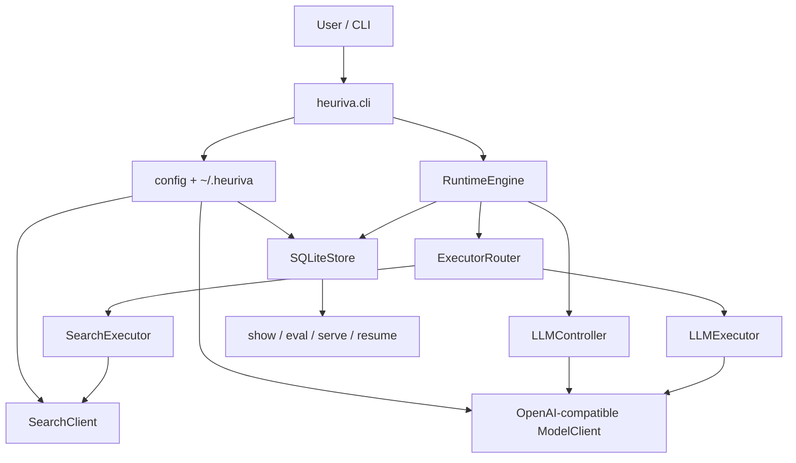

# Heuriva

[中文文档](README-CN.md)

Heuriva is a Python **CLI cognitive runtime** for language models. It makes task
solving explicit: structured state, one cognitive operator per step, and a full
SQLite trajectory you can inspect, evaluate, and safely resume.

It is not a general-purpose agent framework, not a messaging gateway, and not a
library-first SDK. Day-to-day entry points are the `heuriva` CLI and the
**localhost Session UI** (`heuriva serve`). An optional **Tauri** desktop
installer wraps the same Session surface (shell + Python sidecar) — not a remote
dashboard, not Feishu, and not VERIFY.

## What it does

- Runs a task as a loop over three operators: `ANALYZE` → `SEARCH` → `ANSWER`
  (chosen dynamically each step, not as a fixed pipeline).
- Keeps an immutable `CognitiveState` and a stable `TaskContract`.
- Separates **operator selection** (controller) from **executor routing**
  (deterministic code).
- Persists every committed step to local SQLite: state, decision, observation.
- Validates citations against saved evidence; assesses completion against your
  contract (default quality mode is observe, not silent rewrite).
- Lets you run and resume from CLI **or** the localhost **Session UI**
  (`heuriva serve`): send a goal, browse recent tasks, open detail, resume.
  Optional Tauri `.dmg` / `.exe` installers are a thin shell around the same UI.

## Quick start

```bash
python3 -m venv .venv
.venv/bin/pip install -e '.[dev]'

heuriva setup
heuriva doctor --probe
heuriva run --trace "Analyze whether this project should become a product"
```

Default model config targets an OpenAI-compatible endpoint
(`http://localhost:8765/v1`, `model: auto`). Point `HEURIVA_LLM_BASE_URL` /
`HEURIVA_LLM_MODEL` at any compatible chat-completions service.

```bash
# Inspect / Session
heuriva list                     # recent tasks: short id + status + goal
heuriva list --json --limit 50
heuriva show --trace <task_id>
heuriva serve                    # localhost Session UI (run / list / resume)
heuriva serve --read-only        # inspector only (no writes)
heuriva eval <task_id>           # read-only quality summary
heuriva eval --judge <task_id>   # opt-in fresh model judge

# Continue after Ctrl+C / failure (appends steps; never rewrites history)
heuriva resume <task_id>

# Offline regression suite (no network by default)
heuriva eval-suite
```

Desktop installer (optional; same Session UI via Tauri + Python sidecar):

```bash
./scripts/build-desktop.sh           # macOS .dmg / .app
./scripts/build-desktop-windows.sh   # Windows best effort
```

See `desktop/README.md`. Unsigned local builds may trip Gatekeeper / SmartScreen.

Structured completion criteria (optional):

```bash
heuriva run --criterion-exact 'OK' "Return exactly OK and no other text."
heuriva run --criterion 'must_include:tradeoffs' --search-policy forbidden \
  "Explain the local project direction without web search"
```

## Architecture

```text
CLI / config
  → RuntimeEngine
  → CognitiveState + TaskContract
  → LLMController  (selects one operator)
  → ExecutorRouter (ANALYZE/ANSWER → llm, SEARCH → search)
  → OperationResult → validation (search / citation / completion)
  → StateUpdater   (immutable next state)
  → SQLiteStore    (atomic step commit)
  → show / eval / serve / resume
```



### Design invariants

| Concern | Approach |
| --- | --- |
| State | Immutable Pydantic snapshots; patches cannot rewrite goal/contract |
| Control | Controller picks operator only; router maps executors |
| Evidence | Search candidates vs accepted evidence; only accepted evidence counts as progress |
| Answers | Citation labels like `[S1]` must map to saved evidence |
| Quality | Deterministic checks + optional model assessor/judge; defaults stay `observe` |
| Persistence | One atomic SQLite transaction per committed step |
| Resume | Reload last committed state; append new steps; never edit history |

### Module map

| Area | Responsibility |
| --- | --- |
| `cli.py` | `setup`, `doctor`, `run`, `resume`, `list`, `show`, `eval`, `eval-suite`, `serve` |
| `runtime/` | Loop, guards, validation, resume eligibility, engine factory |
| `controller/` | Structured operator selection + JSON repair |
| `executors/` | ANALYZE / ANSWER (LLM) and SEARCH |
| `storage/` | SQLite trajectory + eval_runs |
| `web/` | Localhost Session UI + trajectory inspector |
| `desktop/` | Optional Tauri 2 shell + Python sidecar installer |

## How to use (day-to-day)

1. **`heuriva setup`** — create `~/.heuriva/config.yaml`, `.env`, and DB path.
2. **`heuriva doctor`** — check config, schema, stale running tasks; `--probe` for a minimal chat call.
3. **`heuriva run "..."`** — execute a new task; progress on stderr; `--json` keeps stdout clean.
4. **Ctrl+C** — exits `130`, keeps committed steps as `interrupted`; resume with the printed task id.
5. **`heuriva list`** — recent tasks with short id, status, step count, and goal summary.
6. **`heuriva resume <task_id>`** — continue from the last committed state (rejects `done` unless `--force`).
7. **`heuriva show` / `serve`** — inspect; `serve` is the Session UI (use `--read-only` for inspector-only).
8. **`heuriva eval`** — summarize quality signals; `--judge` is explicit and does not rewrite the trajectory.
9. **Desktop (optional)** — `./scripts/build-desktop.sh` builds a Tauri shell + sidecar installer.

Config lives under `~/.heuriva/`. API keys stay in env vars (`HEURIVA_API_KEY`), never in YAML or SQLite. Search queries go to a third-party provider when search is enabled; snippets are treated as untrusted data.

## Heuriva vs OpenClaw vs Hermes Agent

These solve different jobs. Heuriva is a **small, inspectable cognitive loop** for
studying and controlling how a frozen-weight model solves tasks. OpenClaw and
Hermes are broader **personal / multi-channel agent platforms**.

| | Heuriva | OpenClaw | Hermes Agent |
| --- | --- | --- | --- |
| Primary job | Explicit cognitive runtime + trajectory science | Gateway / multi-channel control plane | Agent-first runtime with skill learning |
| Interface | CLI + localhost Session UI (+ optional Tauri installer) | Many messaging channels + CLI | TUI / desktop (+ gateways) |
| Operators / tools | Fixed trio: ANALYZE / SEARCH / ANSWER | Large skill + integration surface | Built-in tools + agent-written skills |
| Memory story | SQLite trajectory (process evidence), not long-term “memory product” | Session / files / ecosystem memory | Persistent + procedural skill memory |
| Learning | Not a goal (recording ≠ learning) | Human-authored skills / marketplace | Self-improving procedural skills |
| Model I/O | OpenAI-compatible chat completions | Model-agnostic | Model-agnostic |
| Best fit | Reproducible task traces, contracts, eval, safe resume | Reach: put an agent where users already chat | Autonomy: agents that refine their own skills |

**Use Heuriva when** you care about *why* each step was chosen, whether evidence
was accepted, whether the answer met a contract, and whether you can resume
without rewriting history.

**Use OpenClaw / Hermes when** you need messaging reach, large tool ecosystems,
or agents that accumulate reusable skills over time. Heuriva deliberately does
not try to replace those products.

## Boundaries (intentionally out of scope)

- No default `VERIFY` operator, no default semantic `enforce`, no default fresh judge
- No MCP, multi-agent roles, shell/filesystem/Python executors, or URL crawling beyond search APIs
- No remote multi-tenant dashboard (Session UI / `serve` is localhost-only; Tauri is a thin local shell)
- No procedural learning / policy lifecycle as a shipped product feature
- Resume is not a full experiment replay lab or time-travel editor

## Development

Requires Python 3.11+.

```bash
.venv/bin/pip install -e '.[dev]'
.venv/bin/ruff format --check .
.venv/bin/ruff check .
.venv/bin/mypy src tests
.venv/bin/pytest
.venv/bin/heuriva --version
.venv/bin/heuriva eval-suite --json
.venv/bin/heuriva serve --help
.venv/bin/heuriva resume --help
# optional packaging
# ./scripts/build-sidecar.sh
# ./scripts/build-desktop.sh
```

Live LLM/search tests are opt-in:

```bash
HEURIVA_RUN_LIVE_LLM_TESTS=1 .venv/bin/pytest tests/live/test_live_llm.py
HEURIVA_RUN_LIVE_SEARCH_TESTS=1 .venv/bin/pytest tests/live/test_live_search.py
```

License: MIT.
